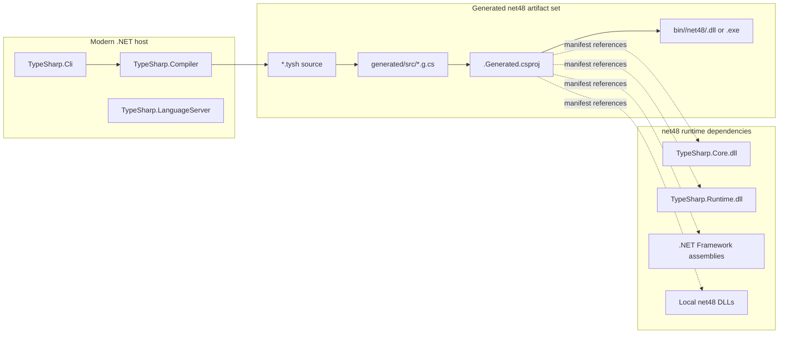
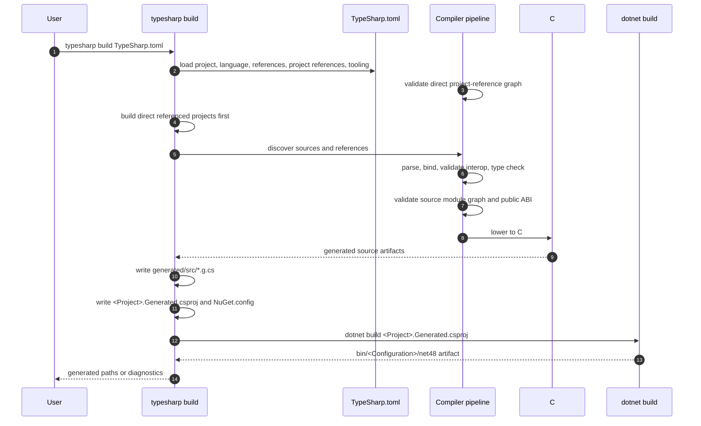
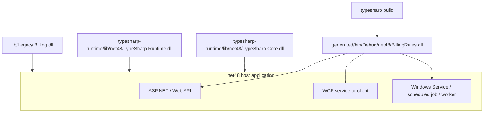

TypeSharp projects produce ordinary `.NET Framework 4.8` artifacts through a conservative source backend. The compiler and CLI can run on a modern .NET host, but the generated project, generated assembly, `TypeSharp.Core`, and `TypeSharp.Runtime` stay on the `net48` side of the boundary.

Use [Install](../install/) first to download the release CLI, verify `SHA256SUMS.txt`, and extract the matching runtime archive used by the examples below.

## Artifact Boundary

The key split is between the tool host and the runtime artifact.



Rules:

- `TypeSharp.Compiler`, `TypeSharp.Cli`, and `TypeSharp.LanguageServer` are tooling projects.
- Generated user assemblies target `net48`.
- `TypeSharp.Core` targets `net48` and contains user-facing public types such as `Option<T>`, `Result<T, E>`, and `Unit`.
- `TypeSharp.Runtime` targets `net48` and contains compiler-generated helper APIs for unions, pattern matching, equality, hashing, and async helpers.
- Docs dependencies, Node packages, and Astro build output are documentation-only and are not part of generated runtime deployment.

## Build Pipeline

`typesharp check` stops before emission. `typesharp build` runs the same diagnostics path, emits C# source, writes a generated SDK-style project, then invokes `dotnet build` in the generated output root.



Emission happens only when blocking diagnostics are absent. Reference diagnostics, project-reference diagnostics, parser errors, type errors, public boundary diagnostics, unsupported packages, and interop validation failures stop before generated C# project build.

## Generated Project Shape

The generated project is written under `project.generatedOutputRoot` from `TypeSharp.toml`. The default output root is `obj/generated`; many examples use `generated` to make the artifact tree easier to inspect.

```text
generated/
  src/Main.g.cs
  src/Feature/Rules.g.cs
  <ProjectName>.Generated.csproj
  NuGet.config
  bin/Debug/net48/<ProjectName>.dll
  obj/
```

The generated `.csproj` uses these stable properties:

```xml
<Project Sdk="Microsoft.NET.Sdk">
  <PropertyGroup>
    <TargetFramework>net48</TargetFramework>
    <OutputType>Library</OutputType>
    <LangVersion>7.3</LangVersion>
    <ImplicitUsings>false</ImplicitUsings>
    <Nullable>disable</Nullable>
    <AssemblyName>ProjectName</AssemblyName>
    <RootNamespace>ProjectName</RootNamespace>
  </PropertyGroup>
</Project>
```

Executable projects use `OutputType` `Exe` and produce `.exe` instead of `.dll`. `typesharp run` builds the executable first, then launches the generated `.exe` and forwards values after `--` to `main(args: string[])`.

## Reference Flow

The manifest is the only current source of generated project references. Framework assemblies, local DLLs, `TypeSharp.Core.dll`, and `TypeSharp.Runtime.dll` enter the generated project through `[references]`. Direct TypeSharp project references enter through `[projectReferences]` and resolve to generated assemblies after the referenced projects build.

```toml
[project]
name = "BillingRules"
targetFramework = "net48"
outputType = "library"
rootNamespace = "Company.Billing"
generatedOutputRoot = "generated"

[references]
assemblies = [
  "System",
  "System.Core"
]
paths = [
  "lib/Legacy.Billing.dll",
  "../typesharp-runtime/lib/net48/TypeSharp.Core.dll",
  "../typesharp-runtime/lib/net48/TypeSharp.Runtime.dll"
]
packages = []

[projectReferences]
paths = ["../Shared/TypeSharp.toml"]
```

Reference rules:

- `references.assemblies` becomes framework `<Reference Include="..."/>` items.
- `references.paths` becomes local `<Reference>` items with generated-project-relative `<HintPath>` values. Runtime/Core paths should point at the verified extracted runtime archive, not repository build folders.
- `projectReferences.paths` names direct TypeSharp manifests. `typesharp build` builds those projects first and then writes local `<Reference>` items with hint paths to the referenced generated assemblies.
- `references.packages` is reserved and currently reports `TS2405`; TypeSharp does not restore NuGet packages during build. Future support must preserve deterministic lock files, package source mapping, vulnerability auditing, license inventory, checksum/signature policy, and offline-friendly no-package builds.
- The generated project writes an offline `NuGet.config` with package sources cleared so normal builds do not accidentally resolve hidden packages.

## TypeSharp Project References

The current preview reads `[projectReferences] paths = [...]` entries that point at other TypeSharp manifests, not DLLs. It does not write generated MSBuild `<ProjectReference>` items yet; the dependent generated project uses explicit local `<Reference>` items to the referenced generated assemblies after build ordering has been enforced by the TypeSharp builder.

The artifact policy is:

- A referenced TypeSharp project is checked and built before the dependent project.
- The dependent project receives explicit generated assembly paths and compiler-derived TypeSharp module/export metadata for direct referenced source imports.
- The generated `net48` project currently uses local `<Reference>` items. Generated `<ProjectReference>` items remain future work until output paths and metadata inputs are deterministic enough for that shape.
- Source-level imports across project boundaries require direct manifest project references; TypeSharp does not infer visibility from arbitrary sibling folders or hidden transitive references.
- Project-reference diagnostics must stop before the dependent generated project is emitted when a referenced manifest, artifact, target framework, or exported module member is invalid.

This keeps TypeSharp's build graph aligned with ordinary .NET artifact consumption while preserving the source module graph as the compiler-owned authority.

## Core And Runtime Roles

`TypeSharp.Core` and `TypeSharp.Runtime` solve different problems.

| Assembly | Public Role | Referenced When |
| --- | --- | --- |
| `TypeSharp.Core.dll` | User-facing `Option<T>`, `Result<T, E>`, `Unit`, and small core public helpers. | TypeSharp source imports `TypeSharp.Core` or exposes core types to C# consumers. |
| `TypeSharp.Runtime.dll` | Generated-code helper surface for nominal union cases, pattern matching, equality/hash composition, and async helpers. | Generated C# needs `TypeSharp.Runtime` helpers, for example nominal unions or union matches. |

Current preview builds require these assemblies to be available as local `net48` DLL references when a project uses them. Open the tag-specific GitHub Release notes, confirm the exact asset names, then download and verify the release runtime archive with `SHA256SUMS.txt`. The archive is `typesharp-runtime-net48-<tag>.zip` and expands to `lib/net48/TypeSharp.Core.dll` plus `lib/net48/TypeSharp.Runtime.dll`. A generated assembly that exposes `Option<T>` or `Result<T,E>` to C# consumers also requires the consuming C# project to reference `TypeSharp.Core.dll`. A generated assembly that exposes nominal union cases or calls runtime pattern helpers requires the host or consumer project to deploy `TypeSharp.Runtime.dll` beside the generated assembly.

The 1.0 runtime resolution policy is explicit installed runtime archive references: extract the matching runtime zip and reference `../typesharp-runtime/lib/net48/TypeSharp.Core.dll` and `../typesharp-runtime/lib/net48/TypeSharp.Runtime.dll` through `references.paths`. The CLI does not implicitly discover repository build folders, auto-copy runtime assemblies, or add hidden template references for 1.0; CLI auto-copy and implicit template references remain post-1.0 ergonomics unless they are promoted with separate release evidence.

## Source To Artifact Example

This TypeSharp source:

```tysh
namespace Company.Billing

import { Option, Result } from "TypeSharp.Core"

public union InvoiceStatus {
  Draft
  Posted(id: string)
}

export fun keepOption(value: Option<string>): Option<string> = value

export fun keepResult(value: Result<InvoiceStatus, string>): Result<InvoiceStatus, string> = value

export fun posted(id: string): InvoiceStatus = Posted(id)

export fun describe(status: InvoiceStatus): string =
  match status {
    Draft => "Draft"
    Posted(id) => $"Posted:{id}"
  }
```

needs both `TypeSharp.Core.dll` and `TypeSharp.Runtime.dll`:

- `Option<T>` and `Result<T, E>` come from `TypeSharp.Core`.
- `InvoiceStatus` lowers to CLR-visible generated union classes that implement runtime union metadata from `TypeSharp.Runtime`.
- The generated project builds a `net48` assembly that C# can reference together with both TypeSharp helper assemblies.

The current release ABI exposes `Result<T,E>` factories to C# as `Result<T,E>.Ok(...)` and `Result<T,E>.Error(...)`. Direct TypeSharp imports named `Ok` and `Error` are future source ergonomics, not the current installed runtime reference shape.

## Deployment Set

A host consumes the output like an ordinary .NET Framework class library.



The deployable set is:

1. the generated TypeSharp assembly,
2. `typesharp-runtime/lib/net48/TypeSharp.Core.dll` from the verified matching runtime archive when public APIs or source imports use core types,
3. `typesharp-runtime/lib/net48/TypeSharp.Runtime.dll` from the verified matching runtime archive when generated code uses runtime helpers,
4. referenced local DLLs from `references.paths`,
5. the normal .NET Framework assemblies available to the target host.

The C# host may reference those paths directly during build or copy the DLLs beside the generated assembly for deployment, but they must come from the same verified runtime archive tag and Runtime ABI as the CLI release.

TypeSharp does not require a custom loader, startup hook, ASP.NET Core migration, or nonstandard AppDomain lifecycle hook for the current artifact shape.

## Release Runtime Layout Smokes

The release-style smokes use the CLI wrapper and runtime archive layout from clean directories outside the repository. The staged smoke proves the layout before publication; the hosted release workflow resolves the hosted download/extraction root and clean smoke workspace outside the repository checkout, then repeats the same installed-command, host-prerequisite failure, local-DLL dependency, dependency-diagnostic, generated-build-failure, project-reference build-order, runtime-backed library, and C# consumer output shape against the downloaded GitHub Release assets after publication.

1. Open the tag-specific GitHub Release notes, confirm the exact asset names, extract verified `typesharp-cli-dotnet-<tag>.zip`, put the extracted directory on `PATH`, and verify bare `typesharp` resolves to the downloaded `typesharp.cmd`.
2. Verify the downloaded wrapper reports a missing `dotnet` host when the host is removed from `PATH`, without implying generated `net48` projects need that same host target.
3. Extract verified `typesharp-runtime-net48-<tag>.zip` under a workspace-local runtime folder.
4. Create, check, build, and run a clean console project through the installed `typesharp` command.
5. Build a local C# `net48` DLL, reference it with `references.paths = ["../lib/Legacy.Tools.dll"]`, build a generated TypeSharp library against it, and compile a separate C# `net48` consumer that references both assemblies.
6. Verify missing local DLL and unsupported package references report `TS2401`/`TS2405` and do not emit generated source, generated projects, or generated assemblies.
7. Verify generated C# project build failures report `TS3501` after generated source/project emission and before a generated assembly is produced.
8. Create a shared library and a dependent library with `[projectReferences] paths = ["../HostedShared/TypeSharp.toml"]`, then build the dependent project through installed `typesharp` and verify the referenced generated assembly exists before the dependent assembly.
9. Create a library with `typesharp new library`.
10. Reference `../typesharp-runtime/lib/net48/TypeSharp.Core.dll` and `../typesharp-runtime/lib/net48/TypeSharp.Runtime.dll` through `references.paths`.
11. Build TypeSharp source that exposes `Option<T>`, `Result<T,E>`, a nominal union, union match lowering, and generated `net48` output.
12. Compile a separate C# `net48` consumer that references the generated assembly plus the extracted Core/Runtime DLLs and calls `TypeSharp.Runtime` union and async helper APIs.

This proves the supported preview shape is explicit local DLL references from the installed runtime archive, not discovery from repository build folders. The hosted smoke also verifies the hosted download/extraction root and clean smoke workspace stay outside the repository checkout, the release page metadata, `SHA256SUMS.txt`, the exact CLI/runtime/VSIX/checksum asset set, the exact CLI/runtime/VSIX checksum manifest entry set, duplicate-free lowercase SHA-256 manifest rows, the VSIX checksum entry, archive shape, package identity, and TypeSharp language/grammar contribution metadata, the CLI archive `typesharp.dll`/`typesharp.cmd`/`TypeSharp.Compiler.dll`/`TypeSharp.LanguageServer.dll` files, CLI README release metadata, runtime README tag/build/source/ABI/target metadata and DLL list, the downloaded wrapper content for command echo suppression, local environment scope, extracted-directory `TYPESHARP_HOME`, and `dotnet "%TYPESHARP_HOME%typesharp.dll" %*` launch behavior, the prerelease/channel policy, runtime ABI status, default target framework, mandatory release-note sections, compatibility matrix header and expected release row, preview signature policy, installed `typesharp version` text plus JSON CLI/compiler/language identity and target/framework/runtime metadata, and downloaded wrapper host-prerequisite failure before exercising `typesharp new`, `typesharp format --check`, `typesharp check`, `typesharp build`, and `typesharp run` through the installed command path, compiling a local C# DLL dependency path, verifying text and JSON dependency diagnostics, verifying text and JSON generated C# build-failure diagnostics, checking installed `typesharp explain` output for those recovery codes, compiling a direct TypeSharp project-reference pair, verifying library-project `typesharp run` rejection, the runtime-backed TypeSharp library, and a separate C# `net48` consumer output directory containing the generated assembly plus byte-identical Core/Runtime DLLs from the downloaded runtime archive.

## Invariants

- Generated projects target `net48` unless a future documented profile changes that.
- `net481` is a qualified future profile, not an automatic upgrade. It needs Core/Runtime, generated project, C# consumer, and host smoke evidence before TypeSharp can claim support.
- Generated C# stays C# 7.3-compatible.
- Generated output is reproducible from source and should not be committed.
- Source discovery excludes `bin`, `obj`, `.git`, and the generated output root.
- Diagnostics preserve source paths and stop emission before generated project build when the error is known at TypeSharp level.
- Compile-time-only constructs such as structural shapes, type-level unions, and anonymous public boundaries must be wrapped in nominal CLR-visible types before crossing public ABI.
- Runtime ABI `0` is preview. Compiler and runtime ABI constants must remain aligned.

## Evidence

Repository evidence for this artifact model lives in:

- `lang/TypeSharp.Compiler/Building/TypeSharpBuilder.cs`
- `lang/TypeSharp.Compiler/Checking/TypeSharpChecker.cs`
- `lang/TypeSharp.Core/TypeSharp.Core.csproj`
- `lang/TypeSharp.Runtime/TypeSharp.Runtime.csproj`
- `test/TypeSharp.Compiler.Tests/Program.cs`

Focused smoke areas include generated C# project scaffold, manifest reference propagation, generated `net48` assembly build, C# `net48` consumer builds, Core/Runtime `net48` builds, and ASP.NET/WCF/worker-style host compatibility builds.

## Related Pages

- [Project Configuration](../project-configuration/)
- [.NET Interop](../dotnet-interop/)
- [Lowering](../lowering/)
- [API And CLI Reference](../api/)
- [CLI](../cli/)
