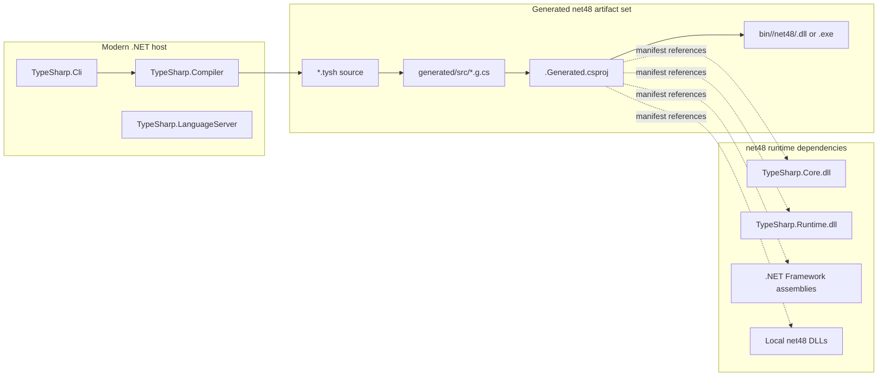
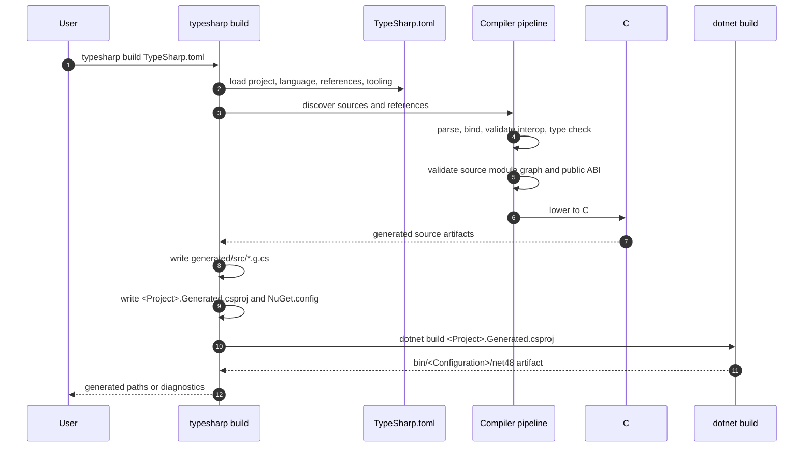
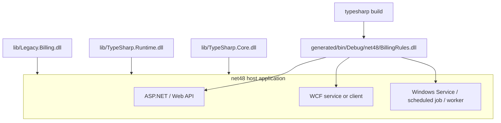

TypeSharp projects produce ordinary `.NET Framework 4.8` artifacts through a conservative source backend. The compiler and CLI can run on a modern .NET host, but the generated project, generated assembly, `TypeSharp.Core`, and `TypeSharp.Runtime` stay on the `net48` side of the boundary.

## Artifact Boundary

The key split is between the tool host and the runtime artifact.



Rules:

- `TypeSharp.Compiler`, `TypeSharp.Cli`, and `TypeSharp.LanguageServer` are tooling projects.
- Generated user assemblies target `net48`.
- `TypeSharp.Core` targets `net48` and contains user-facing public types such as `Option<T>`, `Result<T, E>`, and `Unit`.
- `TypeSharp.Runtime` targets `net48` and contains compiler-generated helper APIs for unions, pattern matching, equality, hashing, and async helpers.
- Docs dependencies, Node packages, and Astro build output are documentation-only and are not part of generated runtime deployment.

## Build Pipeline

`typesharp check` stops before emission. `typesharp build` runs the same diagnostics path, emits C# source, writes a generated SDK-style project, then invokes `dotnet build` in the generated output root.



Emission happens only when blocking diagnostics are absent. Reference diagnostics, parser errors, type errors, public boundary diagnostics, unsupported packages, and interop validation failures stop before generated C# project build.

## Generated Project Shape

The generated project is written under `project.generatedOutputRoot` from `TypeSharp.toml`. The default output root is `obj/generated`; many examples use `generated` to make the artifact tree easier to inspect.

```text
generated/
  src/Main.g.cs
  src/Feature/Rules.g.cs
  <ProjectName>.Generated.csproj
  NuGet.config
  bin/Debug/net48/<ProjectName>.dll
  obj/
```

The generated `.csproj` uses these stable properties:

```xml
<Project Sdk="Microsoft.NET.Sdk">
  <PropertyGroup>
    <TargetFramework>net48</TargetFramework>
    <OutputType>Library</OutputType>
    <LangVersion>7.3</LangVersion>
    <ImplicitUsings>false</ImplicitUsings>
    <Nullable>disable</Nullable>
    <AssemblyName>ProjectName</AssemblyName>
    <RootNamespace>ProjectName</RootNamespace>
  </PropertyGroup>
</Project>
```

Executable projects use `OutputType` `Exe` and produce `.exe` instead of `.dll`. `typesharp run` builds the executable first, then launches the generated `.exe` and forwards values after `--` to `main(args: string[])`.

## Reference Flow

The manifest is the only current source of generated project references. Framework assemblies, local DLLs, `TypeSharp.Core.dll`, and `TypeSharp.Runtime.dll` enter the generated project through `[references]`.

```toml
[project]
name = "BillingRules"
targetFramework = "net48"
outputType = "library"
rootNamespace = "Company.Billing"
generatedOutputRoot = "generated"

[references]
assemblies = [
  "System",
  "System.Core"
]
paths = [
  "lib/Legacy.Billing.dll",
  "lib/TypeSharp.Core.dll",
  "lib/TypeSharp.Runtime.dll"
]
packages = []
```

Reference rules:

- `references.assemblies` becomes framework `<Reference Include="..."/>` items.
- `references.paths` becomes local `<Reference>` items with generated-project-relative `<HintPath>` values.
- `references.packages` is reserved and currently reports `TS2405`; TypeSharp does not restore NuGet packages during build.
- The generated project writes an offline `NuGet.config` with package sources cleared so normal builds do not accidentally resolve hidden packages.

## Core And Runtime Roles

`TypeSharp.Core` and `TypeSharp.Runtime` solve different problems.

| Assembly | Public Role | Referenced When |
| --- | --- | --- |
| `TypeSharp.Core.dll` | User-facing `Option<T>`, `Result<T, E>`, `Unit`, and small core public helpers. | TypeSharp source imports `TypeSharp.Core` or exposes core types to C# consumers. |
| `TypeSharp.Runtime.dll` | Generated-code helper surface for nominal union cases, pattern matching, equality/hash composition, and async helpers. | Generated C# needs `TypeSharp.Runtime` helpers, for example nominal unions or union matches. |

Current preview builds require these assemblies to be available as local `net48` DLL references when a project uses them. A generated assembly that exposes `Option<T>` to C# consumers also requires the consuming C# project to reference `TypeSharp.Core.dll`. A generated assembly that exposes nominal union cases or calls runtime pattern helpers requires the host or consumer project to deploy `TypeSharp.Runtime.dll` beside the generated assembly.

## Source To Artifact Example

This TypeSharp source:

```tysh
namespace Company.Billing

import { Result, Ok, Error } from "TypeSharp.Core"

public union InvoiceStatus {
  Draft
  Posted(id: string)
}

export fun status(id: string?): Result<InvoiceStatus, string> =
  if id == null {
    Error("missing id")
  } else {
    Ok(Posted(id))
  }
```

needs both `TypeSharp.Core.dll` and `TypeSharp.Runtime.dll`:

- `Result<T, E>`, `Ok`, and `Error` come from `TypeSharp.Core`.
- `InvoiceStatus` lowers to CLR-visible generated union classes that implement runtime union metadata from `TypeSharp.Runtime`.
- The generated project builds a `net48` assembly that C# can reference together with both TypeSharp helper assemblies.

## Deployment Set

A host consumes the output like an ordinary .NET Framework class library.



The deployable set is:

1. the generated TypeSharp assembly,
2. `TypeSharp.Core.dll` when public APIs or source imports use core types,
3. `TypeSharp.Runtime.dll` when generated code uses runtime helpers,
4. referenced local DLLs from `references.paths`,
5. the normal .NET Framework assemblies available to the target host.

TypeSharp does not require a custom loader, startup hook, ASP.NET Core migration, or nonstandard AppDomain lifecycle hook for the current artifact shape.

## Invariants

- Generated projects target `net48` unless a future documented profile changes that.
- Generated C# stays C# 7.3-compatible.
- Generated output is reproducible from source and should not be committed.
- Source discovery excludes `bin`, `obj`, `.git`, and the generated output root.
- Diagnostics preserve source paths and stop emission before generated project build when the error is known at TypeSharp level.
- Compile-time-only constructs such as structural shapes, type-level unions, and anonymous public boundaries must be wrapped in nominal CLR-visible types before crossing public ABI.
- Runtime ABI `0` is preview. Compiler and runtime ABI constants must remain aligned.

## Evidence

Repository evidence for this artifact model lives in:

- `lang/TypeSharp.Compiler/Building/TypeSharpBuilder.cs`
- `lang/TypeSharp.Compiler/Checking/TypeSharpChecker.cs`
- `lang/TypeSharp.Core/TypeSharp.Core.csproj`
- `lang/TypeSharp.Runtime/TypeSharp.Runtime.csproj`
- `test/TypeSharp.Compiler.Tests/Program.cs`

Focused smoke areas include generated C# project scaffold, manifest reference propagation, generated `net48` assembly build, C# `net48` consumer builds, Core/Runtime `net48` builds, and ASP.NET/WCF/worker-style host compatibility builds.

## Related Pages

- [Project Configuration](../project-configuration/)
- [.NET Interop](../dotnet-interop/)
- [Lowering](../lowering/)
- [API And CLI Reference](../api/)
- [CLI](../cli/)
